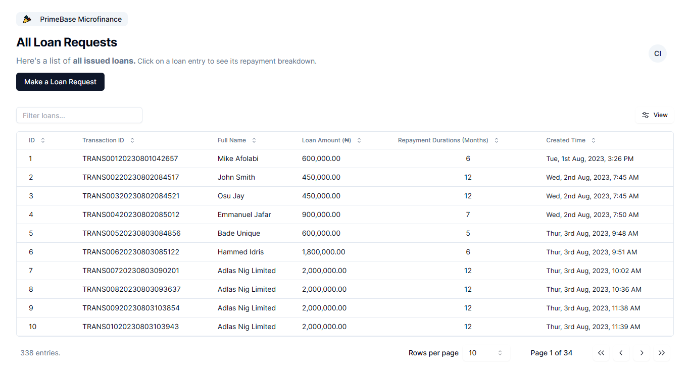
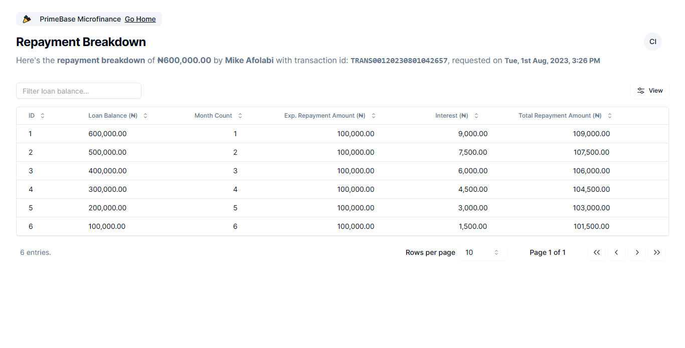
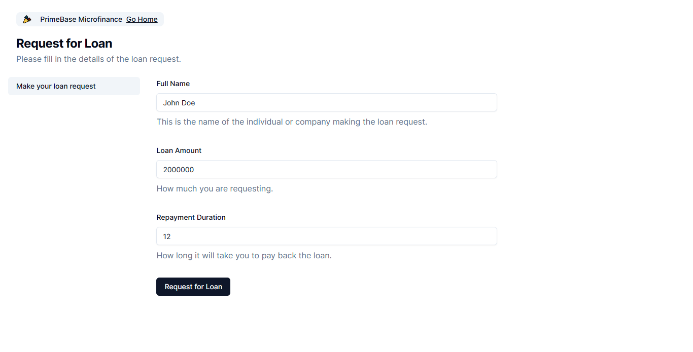
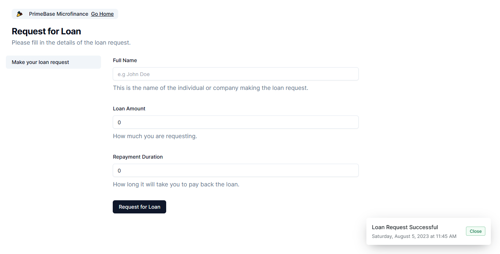

**ConcreteRose Recruitment Online Interview Assessment**

**Candidate:** Chizaram Igolo

**Live URL:** https://primebase-three.vercel.app/ (or https://primebase-chizaram-igolo.vercel.app/)

_Submitted 42 hours after **API documentation issue** was rectified._

**Task:** Design a simple and classic webpage or web pages with ReactJs programming language to perform each function on the API.

## About Project

This application was built using NextJS, a framework that utilizes React (and also provides a better project bootstrapper than `create-react-app` with better dependency management for server/non-browser-based libraries). NextJS provides server-side functionalities such as Server Side Rendering (SSR) and Static Side Generation (SSG). SSR produces fresh dynamic content on the server side making your web page content more dynamic while SSG builds all the HTML on the server side for faster rendering on the client side with the additional benefit of better SEO for the webpage. NextJS also provides server components that let you carry out server-side functions like data fetching from an API.

## To run

- Clone with `git clone https://github.com/Chizaram-Igolo/primebase.git`
- `cd` into folder
- Install all dependencies with `npm install`
- Start the application with `npm run dev` and
- Open `localhost:3000` in your browser to view.

## Product Specification

A Single Page Application that:

- Requests for a loan (`request_for_loan`)
- Gets the list of all loan requests (`get_all_loan_request`)
- Fetches the repayment breakdown for each loan request (`get_repayment_schedule`)

from `https://okigwecreations.online/api/`

## User Stories

As derived from the requirements given in the assessment.

- As a user, I want my view all the loan requests that have been made so that I can browse through them.
- As a user, I want to click on a loan request entry so that I can get the repayment breakdown for it.
- As a user, I want to make a loan request through a form so that I can add a new loan entry.

## Features

- Searchability of data
- Pagination
- Sorting
- Show/Hide Entries
- Toast notification on Form Submission

## Screenshots

### All Loan Requests

### Repayment Breakdown

### Request for Loan

### Request for Loan (After Submission)

## Skills I demonstrated

- Frontend Development using ReactJS and Postman (as well as modern UI libraries)
- API consumption
- State management using React hooks
- Static type-checking with TypeScript
- Pagination, sorting, and filtering of a fairly large dataset

## UI Libraries

- Tailwind CSS (For styling)
- Shadcn/ui (For table and form)
- Radix UI (For toast notification)
